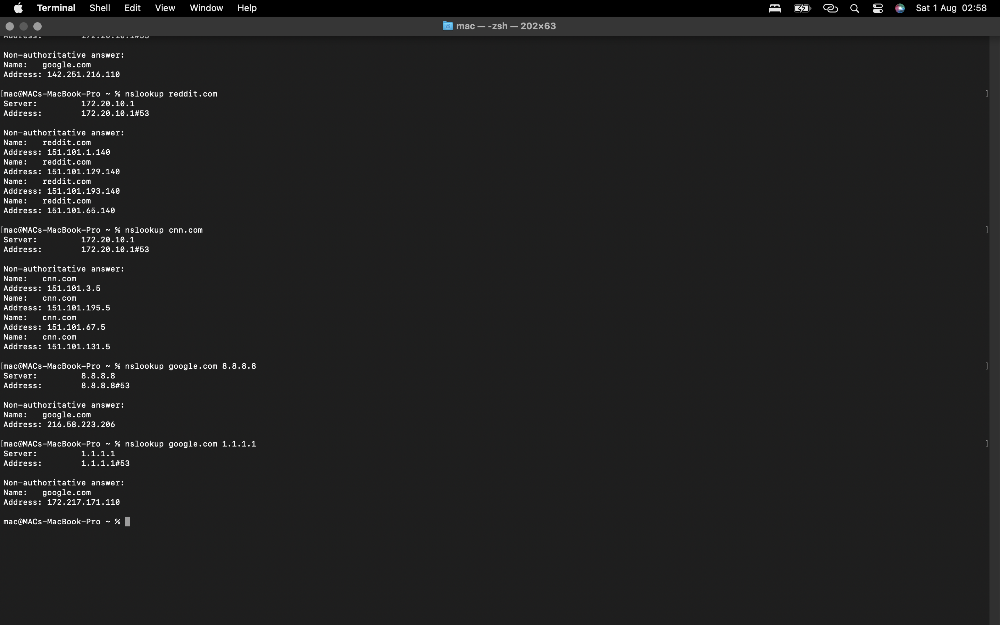

test.md

# Project 1: How a Website Loads When I Type a URL

**Author:** Samuel Akinola

**Date:** July 2026

## Project Objective

To understand what happens behind the scenes when a user enters a website address into a browser and presses Enter.

## Background

Every day, millions of people visit websites without realizing the many networking processes that occur before a webpage appears.

This project explores the sequence of events involved in loading a website and explains the role of important networking protocols such as DNS, ARP, TCP, HTTP, and HTTPS.

## Scenario

I opened my browser and typed: ```<https://www.google.com>```

My objective was to understand every networking process that occurs before Google’s homepage is displayed.

## Step 1: URL Recognition

The browser first recognizes that the address entered is a URL.
```
Example: <https://www.google.com>
```
The browser identifies:

**Protocol:** HTTPS

**Domain Name:** <www.google.com>

**Resource:** Homepage

### What I learnt

The browser separates the protocol from the domain name before starting communication.

## Step 2: DNS Lookup

The computer cannot communicate using domain names. Instead, it needs an IP address. My computer sends a DNS query asking, “What is the IP address of <www.google.com?”>

The DNS server replies with an IP address: ```172.20.10.1``` (Based on my location)

### What I Learnt

DNS converts human-readable domain names into IP addresses that computers use to communicate.

DNS acts like the Internet’s phone book. Without DNS, users would have to memorize IP addresses instead of domain names.

## Step 3: ARP (Local Network)

If the DNS server is on my local network, my computer first needs to determine its MAC address.

It sends an ARP request.

The destination device replies with its MAC address.

### What I Learnt

    IP addresses identify devices logically.

    MAC addresses identify devices physically on a local network.

## Step 4: TCP Three-Way Handshake

Before data can be exchanged, the browser establishes a reliable TCP connection.

The process is:
```text
Client → SYN
Request to establish a connection.

Server → SYN-ACK
Acknowledge the request and agrees to connect.

Client → ACK
Confirms the connection.
```
At this point, the TCP connection is established and data transmission can begin.

### What I Learnt

TCP ensures reliable communication between two devices.

## Step 5 — HTTPS Connection

Because the website uses HTTPS, a TLS handshake occurs.

During this process:

- The server presents its digital certificate.

- The browser verifies that it is valid.

- Encryption keys are exchanged.

- A secure connection is established.

### What I Learnt

HTTPS encrypts data, protecting sensitive information from being intercepted.

## Step 6 — HTTP Request

After the TLS handshake is completed, the browser sends an encrypted HTTP request to the server.

Example (conceptual):

```http
GET / HTTP/1.1 
Host: <www.google.com>
```

## Step 7 — Server Response

The server responds with and encrypted HTTP response containing the requested webpage and its resources (HTML, CSS, JavaScript, Images etc.).

In an enencrypted HTTP connection, the response might look like:

```http
HTTP/ 1.1 200 OK
```

---

## Step 8 — Browser Rendering

The browser downloads all required resources and renders the webpage for the user.

The Google homepage now appears.

---

## Process Flow Diagram
```text

User
 │
 ▼
Browser
 │
 ▼
DNS Lookup
 │
 ▼
IP Address Found
 │
 ▼
TCP Handshake
 │
 ▼
TLS Handshake
 │
 ▼
HTTP Request
 │
 ▼
Web Server
 │
 ▼
HTTP Response
 │
 ▼
Browser Renders Page
```
---

## Key Protocols Used

| Protocol | Purpose |
|----------| --------|
|DNS | Converts domain names to IP addresses|
|ARP | Finds my device addresses on a local network|
|TCP | Establishes a reliable connection|
|TLS | Encrypts communication for HTTPS|
|HTTP | Requests and transfers web content|

---

## Key Note

This project helped me understand that opening a website involves multiple networking processes rather than a single request.

The biggest insight for me was recognizing how each protocol has a specific role: DNS translates names into IP addresses, TCP provides a reliable connection, TLS secures the communication, and HTTP transfers the webpage content.

Understanding these steps also gave me a better appreciation of why **attackers may target different parts of the communication process, such as DNS or unencrypted HTTP traffic, and why security measures like HTTPS are so important.**

## Tools Used

- Safari

- Cisco Networking Academy course materials & <myfirsthack.com>

- Markdown (for documentation)

- GitHub (for version control and portfolio)

## Skills Demonstrated

- Networking fundamentals

- DNS Resolution

- TCP/IP concepts

- Understanding of HTTPS and TLS

- Research skill

- Technical documentation

---
A screenshot of a DNS lookup using nslookup.



---
